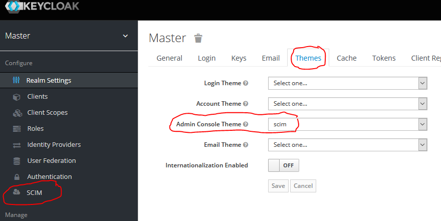
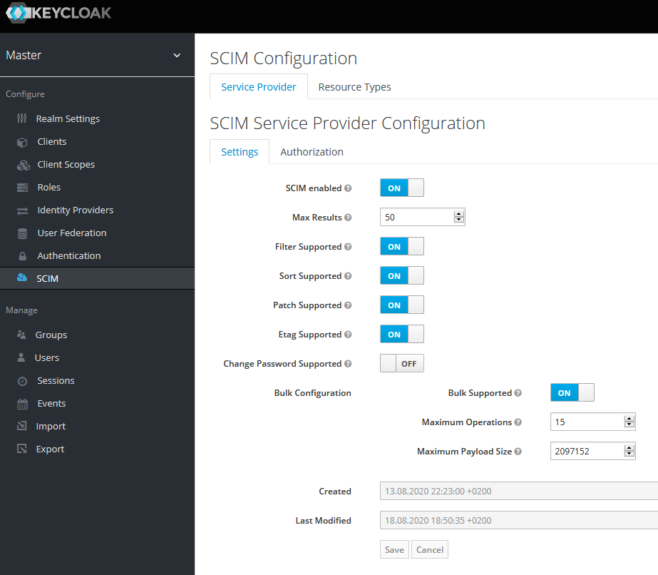
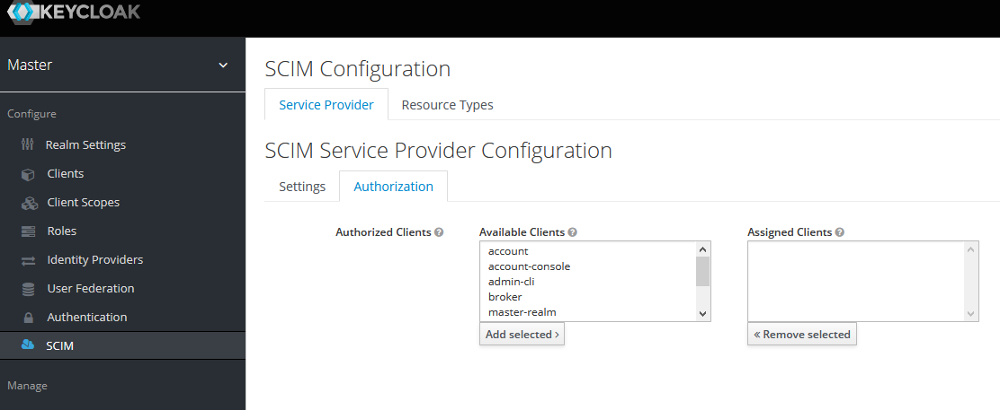
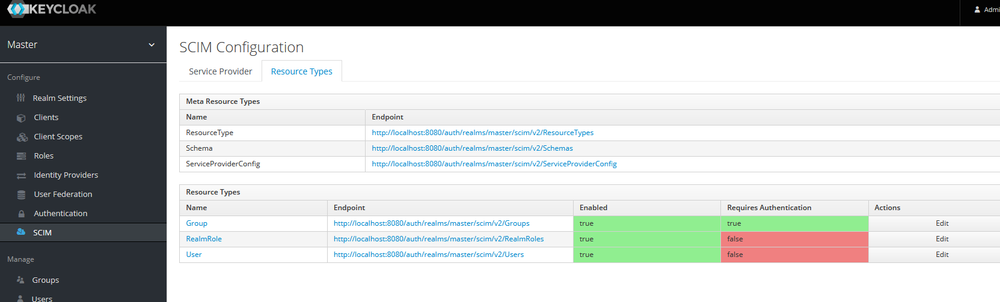
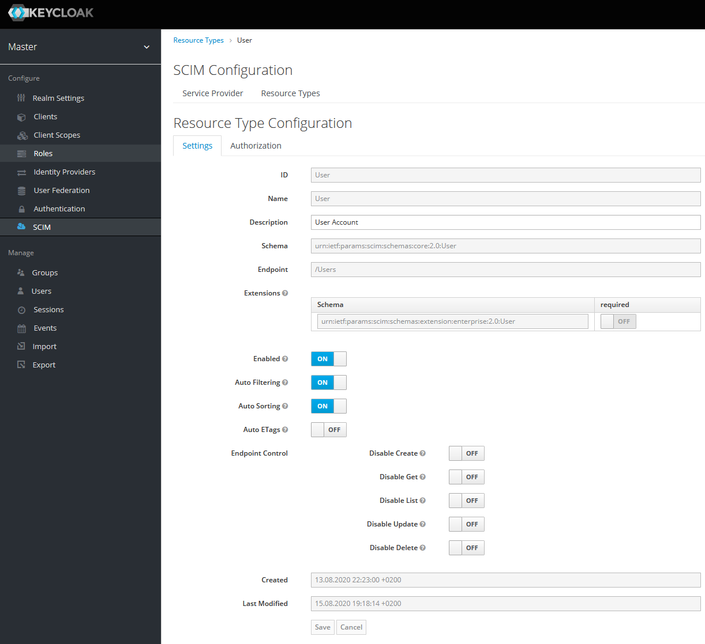
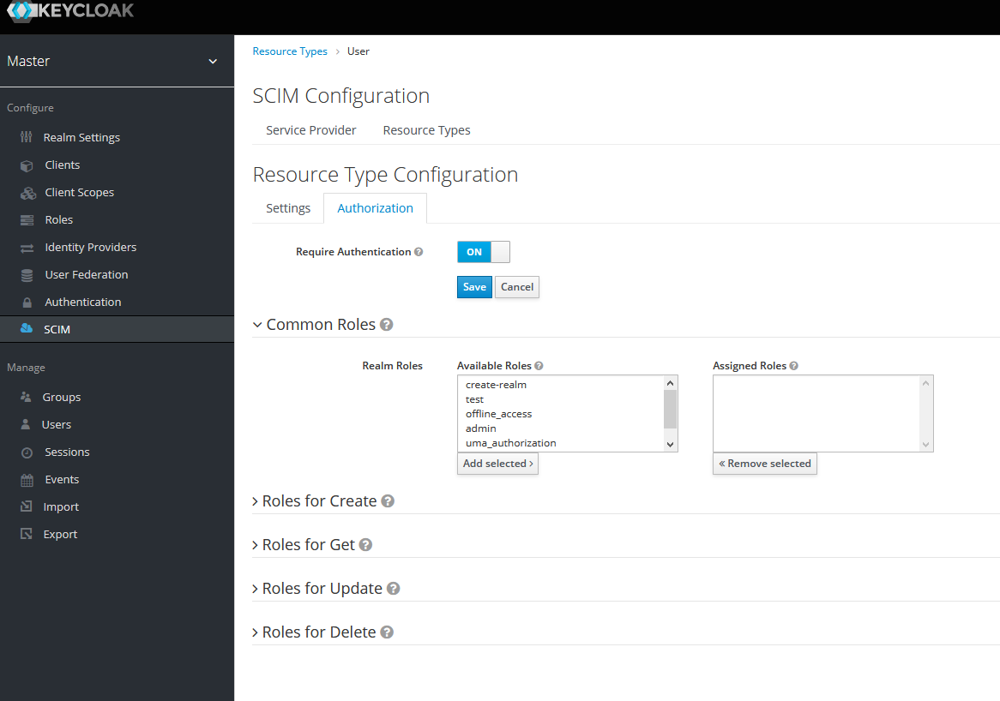
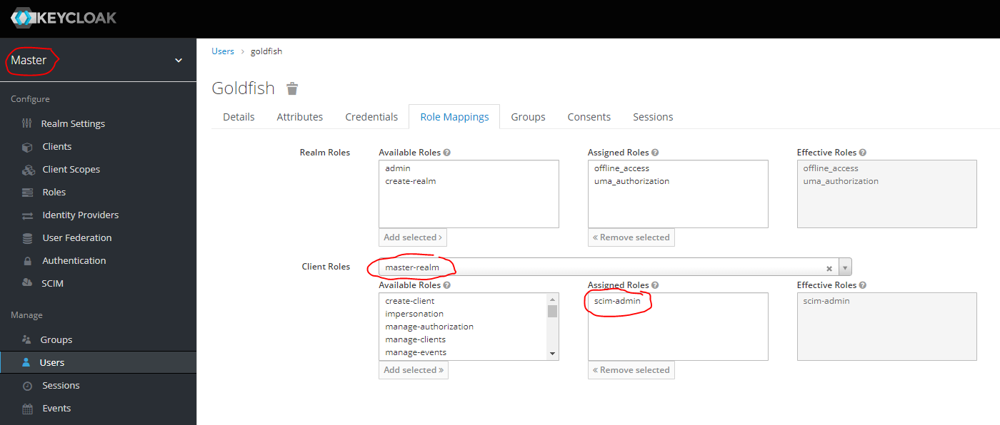
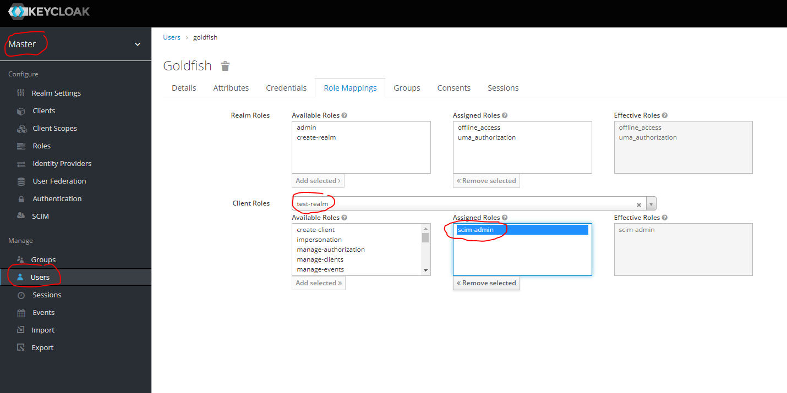

| Branch | Circle CI Status                                                                             |
|:-------|:---------------------------------------------------------------------------------------------|
| master | build deactivated due to build problem on circle-ci. But the current version is still stable |

[//]: # ( master   [![CircleCI]&#40;https://circleci.com/gh/Captain-P-Goldfish/scim-for-keycloak/tree/master.svg?style=shield&#41;]&#40;https://circleci.com/gh/Captain-P-Goldfish/scim-for-keycloak/tree/master&#41;)


## Donations

If you like this work and want to support me you'll be able to treat me to a cup of coffee :-)

[](https://www.paypal.com/donate?hosted_button_id=LLRM6ZVL4G9PJ)

<!-- TOC -->
* [What is SCIM-for-keycloak?](#what-is-scim-for-keycloak)
  * [Keycloak support matrix](#keycloak-support-matrix)
  * [Versioning](#versioning)
  * [Releases](#releases)
  * [Release Notes](#release-notes)
  * [How to build](#how-to-build)
  * [Deploy into keycloak server](#deploy-into-keycloak-server)
  * [Security Considerations](#security-considerations)
  * [How to configure the SCIM endpoints](#how-to-configure-the-scim-endpoints)
  * [Disabled by default](#disabled-by-default)
  * [What is configurable?](#what-is-configurable)
  * [Admin-Events (kc-13-b3, kc-14-b2+)](#admin-events--kc-13-b3-kc-14-b2-)
  * [Disadvantages](#disadvantages)
  * [Grant management-access for configuration](#grant-management-access-for-configuration)
<!-- TOC -->

# What is SCIM-for-keycloak?

It is a full SCIM implementation that is easily integrated into keycloak and is also easily configurable within the web
admin console.

It grants you interoperable User, Group and Role provisioning by using a defined standard for resource managing:

See:

* https://tools.ietf.org/html/rfc7643
* https://tools.ietf.org/html/rfc7644

An example is user and group synchronizing with Microsoft Azure AD. A manual that describes how to do this can be found
in the wiki:

[Use with Microsoft Azure AD](https://github.com/Captain-P-Goldfish/scim-for-keycloak/wiki/Use-with-Microsoft-Azure-AD)
Thanks to *Raffael Grob* for providing this manual.

## Keycloak support matrix

| version         | supported          | scim-for-keycloak version                                                               | SCIM-SDK Version |
|:----------------|:-------------------|:----------------------------------------------------------------------------------------|------------------|
| lower           | :x:                | -                                                                                       |                  |
| 9.0.x           | :x:                | You may find an older working version at https://github.com/Captain-P-Goldfish/SCIM-SDK |                  | 
| 10.0.x          | :x:                | You may find an older working version at https://github.com/Captain-P-Goldfish/SCIM-SDK |                  |  
| 11.0.x          | :heavy_check_mark: | kc-11-b1                                                                                | 1.8.3            |
| 12.0.x          | :heavy_check_mark: | kc-12-b1                                                                                | 1.8.3            |
| 12.0.x          | :heavy_check_mark: | kc-12-b2                                                                                | 1.9.2            |
| 13.0.0          | :heavy_check_mark: | kc-13-b1                                                                                | 1.9.2            |
| 13.0.1          | :heavy_check_mark: | kc-13-b2                                                                                | 1.11.0           |
| 13.0.1          | :heavy_check_mark: | kc-13-b3                                                                                | 1.11.0           |
| 13.0.1          | :heavy_check_mark: | kc-13-b4                                                                                | 1.11.0           |
| 14.0.0          | :heavy_check_mark: | kc-14-b1                                                                                | 1.11.0           |
| 14.0.0          | :heavy_check_mark: | kc-14-b2                                                                                | 1.11.0           |
| 14.0.x          | :heavy_check_mark: | kc-14-b3                                                                                | 1.11.0           |
| 15.0.x          | :heavy_check_mark: | kc-15-b1                                                                                | 1.12.0           |
| 15.0.x          | :heavy_check_mark: | kc-15-b2                                                                                | 1.12.1           |
| 15.0.x          | :heavy_check_mark: | kc-15-b3                                                                                | 1.12.1           |
| 16.0.x          | :x:                | kc-16-b1 (BROKEN -(due to missing theme files)                                          | 1.12.3           |
| 16.0.x          | :heavy_check_mark: | kc-16-b2                                                                                | 1.12.3           |
| 16.1.x          | :x:                | kc-16-b3 (BROKEN - due to liquibase problem)                                            | 1.12.4           |
| 16.1.x          | :heavy_check_mark: | kc-16-b4                                                                                | 1.12.4           |
| 17.0.x          | :x:                | :x:                                                                                     | :x:              |
| 18.0.x          | :heavy_check_mark: | kc-18-b1                                                                                | 1.13.4           |
| 18.0.x / 19.0.x | :heavy_check_mark: | kc-18-b2                                                                                | 1.13.4           |

## Versioning

This project will use the following versioning pattern

```kc-${keycloak.version}-b${project.incremental.version}```

## Releases

Starting with version kc-16-b1 I will upload the built artifacts to github into the release section. Any previous
versions must still be build manually as described below.

## Release Notes

To see the current release-notes take a look into the release
section: https://github.com/Captain-P-Goldfish/scim-for-keycloak/releases

## How to build

You need a git, JDK and maven installation on your computer. A manual in how to prepare java and maven for
non-java-developers can be found in the wiki:
https://github.com/Captain-P-Goldfish/scim-for-keycloak/wiki/Manual:-building-scim-for-keycloak-with-java-and-maven

Checkout the git tag that you want to build:

1. list all available tags:  `git tag -l *`
2. checkout the tag you want to build `git checkout tags/${tag-name}`
3. build with maven
   * `cd ${SCIM_FOR_KEYCLOAK_HOME}`
   * `mvn clean package -DskipTests`
4. find the scim-for-keycloak artifact in:
   `scim-for-keycloak/scim-for-keycloak-server/target/scim-for-keycloak-kc-${keycloak.version}-b${project.incremental.version}.jar`

## Deploy into keycloak server

Add the artifact to the keycloak providers directory `${keycloak.home}/providers` and execute in
`${keycloak.home}/bin` the command `kc.sh build` to install the provider

## Security Considerations

If you open up the SCIM endpoints to a specific realm make sure you setup access rights properly because access is by
default granted to all clients and to all users. This is of course a problematic behaviour in a real world scenario, so
you should restrict the access to specific clients and to users with specific roles as described in
chapter [What is configurable?](#what-is-configurable)

## How to configure the SCIM endpoints

1. Deploy the `scim-for-keycloak.jar` file into your server. If the server is currently running you need to restart it!
2. Now open the web admin console of keycloak open the realm settings and select the `Themes` tab and select the `scim`
   theme for the admin console. Now reload the browser page and the `SCIM` menu link should be visible.
   
3. The SCIM endpoints will be `deactivated by default`. To activate it for a realm toggle the "SCIM enabled" switch
   under the SCIM menu link.

## Disabled by default

Earlier versions of scim-for-keycloak (kc-13-b2 and before and kc-14-b1) did enable the SCIM endpoints by default. The
newer versions will have them disabled by default.

## What is configurable?

1. Select the `SCIM` link and you should see the following view:   
   
2. You can enable SCIM for each realm separately and the `ServiceProvider` configurations as defined in RFC7643
3. You may restrict access to the SCIM-endpoints for each separate realm by allowing users only access if they have been
   identified by a specific client.
   `If no clients are selected any client is authorized to access the SCIM endpoints`  
   
4. You get an overview for all registered `ResourceTypes` and may configure them separately.  
     
   You may have noticed that a 3rd `ResourceType` with name `RealmRole` is present that is not defined by RFC7643. This
   `ResourceType` is a custom endpoint that acts as showcase to demonstrate how easy it is to extend the API with new
   endpoints. This endpoint provides support for adding new `RealmRoles` and associate them with either `Groups` or
   `Users`.
5. Each endpoint provides several settings that can be configured:  
     
   You'll be able to change the description of an endpoint, disable a specific `ResourceType` or just prevent that new
   resources are created, deleted, updated or read.
6. You can turn off the requirement for authentication on each `ResourceType` but not for specific
   `ResourceType`-endpoints.
7. You'll be able to set required roles for each `ResourceType` and each `ResourceType`-endpoint
   [create, get , list, update, delete]
   . `If no roles are applied to an endpoint the API will assume the authorization to be disabled.`
     
   The role settings are of course only respected if authentication is enabled.

## Admin-Events (kc-13-b3, kc-14-b2+)

If admin events are enabled the SCIM endpoint implementations will fire admin events of the following types:

* User [CREATE, UPDATE, DELETE]
* Group [CREATE, UPDATE, DELETE]
   * User GroupMembership [CREATE, DELETE]
   * Group GroupMembership [CREATE, DELETE]
* RealmRole [CREATE, UPDATE, DELETE]

Any event that triggers a `GroupMembership` change will also cause either a `Group_Create` event or a `Group_Update`
event depending on the fact if the resource is getting created or updated.

## Disadvantages

1. I didn't find a really good way in storing multi-valued-complex structures in the user-attributes table so I stored
   such data structures in pure json in this table. Please note that the values in the screenshot are simply
   auto-generated test-values.
   
2. User loading and filtering is not implemented on database level meaning that a "list-Users"-request will currently
   retrieve all Users of the used realm from the database. Filtering, sorting and limiting of the returned entries will
   be done on API level by the SCIM-SDK. (personal tests have shown that this is still pretty fast with at least 5000
   Users. I never tried more)

## Grant management-access for configuration

In some cases you might want to have several administration users that will only be able to configure the SCIM
environment of a single realm. In such a case the user must have specific roles that will grant access to configure the
SCIM environment. If the user does not have the corresponding role the "SCIM"-menu entry will not be visible to this
user.

**NOTE**: Do not get confused with the roles here. These roles are only for accessing the management in the keycloak web
admin console. These roles have nothing to do with accessing the SCIM-endpoints.

Two different roles are required to access the "SCIM"-menu.

1. view-realm (allows the user to see the "SCIM"-menu item on the left)
2. scim-admin (allows the user to modify the SCIM configuration)

The "scim-admin" role exists several times for several clients.

1. For each realm that is created a new "master-client" for this realm is added to the "master" realm. Each of these
   clients will get the "scim-admin" role that is needed for users from the "master" realm to access the "SCIM"-menu. So
   if you create a realm with name "test" you will be able to find a client with name "test-realm" within the clients
   section of the "master" realm. The "scim-admin" role of this client is needed to modify the data of the SCIM
   environment in the "test" realm for users of realm "master".

2. If a new realm "test" is created you should be able to find a client in the clients section of realm "test" with name
   "realm-management". This client should have the client-role "scim-admin". Grant this role to users of realm
   "test" to grant access to the SCIM configuration for this realm.

3. The last case is the SCIM configuration for realm "master". This works analogous to 2. But for realm "master" the
   name of the "master-client" is "master-realm" instead of "realm-management".

So in total we got 2 different cases:

1. users of realm "master" are able to get access to SCIM configurations of several realms.
2. users of other realms can only access the SCIM configuration of their own realm.

  
  
  
